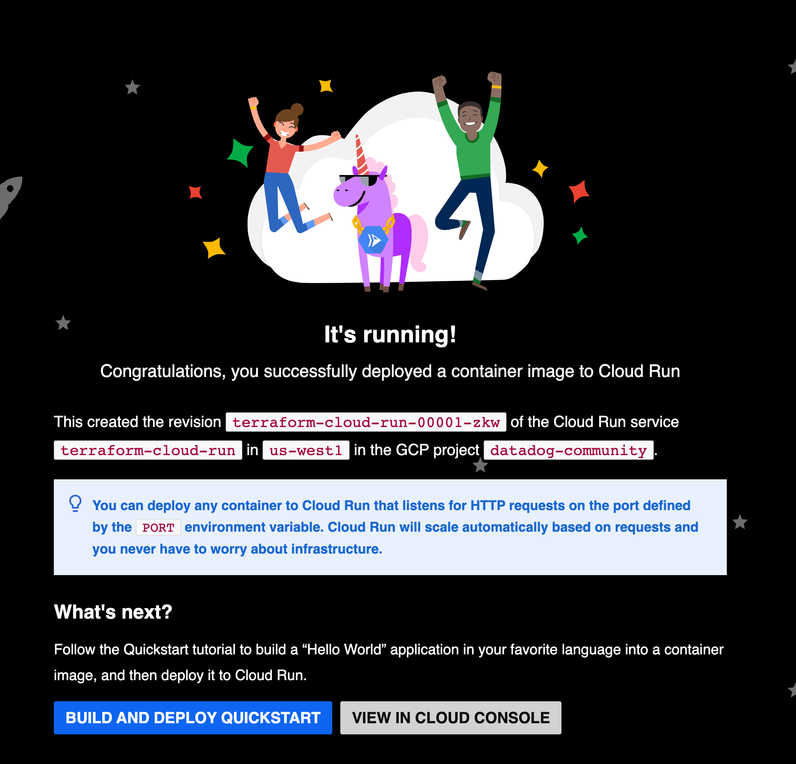

# README

This is code while following along with [Getting started with Google Cloud Run
using Terraform][otobek-cloudrun-tf-youtube].

## Notes about the video

### Defects

- The GCP stuff is done through the GCP console, rather than using `gcloud`.
- Working with credentials is introduced before the creation of the service
  account.
- Claims that the service account needs the role Service Account User and
  says this is to avoid an error. But he doesn't say why this role would
  create an error. What other service account does this one need to use?
  - It turns out that it _does_ need the role `roles/iam.serviceAccountUser`
- He does a 50/50 canary deployment between two revisions of GCP's
  `hello-world` container. But he doesn't explain why.
- Not sure that `roles/run.admin` is the right role for the service account.
  It seems like it's giving the service account a lot of power.

### Pre-requisites

- A [Google Cloud account][gcp-account]
- [Google Cloud CLI][gcloud-install]
- Terraform
  - [Terraform's installation instructions][tf-official-install]
  - I used [homebrew][tf-homebrew-install] to install Terraform, but that's
    apparently [deprecated][tf-homebrew-deprecation].

## My steps (using `gcloud`)

### Set up

1. Initialize your GCP environment and set the default project

  ```sh
  export GCP_PROJECT_ID=datadog-community
  export GCP_SA_NAME=steve-tf-sa
  export GCP_REGION=us-west1
  export GOOGLE_APPLICATION_CREDENTIALS # Set this later

  gcloud init
  gcloud auth login
  # Complete authentication through the browser
  gcloud config set project $GCP_PROJECT_ID
  ```

  In my case, it remembered my default project from a previous session.

1. Create a service account:

   ```sh
   gcloud iam service-accounts create $GCP_SA_NAME \
     --display-name "Steve's Terraform Service Account" \
     --description "Steve Calnan's disposable SA for experimenting and learning"
   ```

1. Grant the service account the ability to use other service accounts (such
   as the default compute user):

   ```sh
    gcloud projects add-iam-policy-binding $GCP_PROJECT_ID \
    --member "serviceAccount:$GCP_SA_NAME@$GCP_PROJECT_ID.iam.gserviceaccount.com" \
    --role "roles/iam.serviceAccountUser"
    ```

1. Add role for Cloud Run:

  ```sh
  gcloud projects add-iam-policy-binding $GCP_PROJECT_ID \
    --member serviceAccount:$GCP_SA_NAME@$GCP_PROJECT_ID.iam.gserviceaccount.com \
    --role roles/run.admin
  ```

1. Create and store a key for the service account:

   ```sh
    gcloud iam service-accounts keys create $GCP_SA_NAME-key.json \
      --iam-account $GCP_SA_NAME@$GCP_PROJECT_ID.iam.gserviceaccount.com
   ```

   And store the path to the key in an environment variable:

   ```sh
   export GOOGLE_APPLICATION_CREDENTIALS=$(pwd)/$GCP_SA_NAME-key.json
   ```

   Note that this is only necessary when running `gcloud` commands as the
   service account. Because we're using Terraform, we'll probably won't
   need it but it could be useful for debugging.

### Deploy

1. Init and apply the Terraform code:

   ```sh
   terraform init
   terraform apply \
     --auto-approve \
     -var "project_id=$GCP_PROJECT_ID" \
     -var "region=$GCP_REGION" \
     -var "sa-key-file=$GOOGLE_APPLICATION_CREDENTIALS"
   ```

   Terraform will print the URL of the service at the end of the apply.

   You can also get the URL after applying by running:

   ```sh
    terraform output cloud_run_service_url
    ```

1. You can check the full status of the service through the GCP console:

   ```sh
   gcloud run services describe hello-world \
     --platform managed \
     --region $GCP_REGION 
   ```

   And filter out specific information, such as the URL:

   ```sh
   gcloud run services describe terraform-cloud-run \
     --platform managed \
     --region $GCP_REGION \
     --format "value(status.url)"
   ```

1. Open the URL in your browser to see the service:

   

### Cleanup

1. To tear down the service, run:

   ```sh
   terraform destroy \
     --auto-approve \
     -var "project_id=$GCP_PROJECT_ID" \
     -var "region=$GCP_REGION" \
     -var "sa-key-file=$GOOGLE_APPLICATION_CREDENTIALS"
   ```

1. Confirm that the service no longer appears in the services list:

   ```sh
   gcloud run services list --platform managed --region $GCP_REGION
   ```

1. To delete the service account, run:

   ```sh
   gcloud iam service-accounts delete $GCP_SA_NAME@$GCP_PROJECT_ID.iam.gserviceaccount.com
   ```

[otobek-cloudrun-tf-youtube]: https://www.youtube.com/watch?v=5Yz1UfFAxdo
[gcp-account]: https://cloud.google.com/
[gcloud-install]: https://cloud.google.com/sdk/docs/install-sdk
[tf-official-install]: https://developer.hashicorp.com/terraform/tutorials/aws-get-started/install-cli
[tf-homebrew-install]: https://formulae.brew.sh/formula/terraform
[tf-homebrew-deprecation]: https://github.com/Homebrew/homebrew-core/pull/139538
